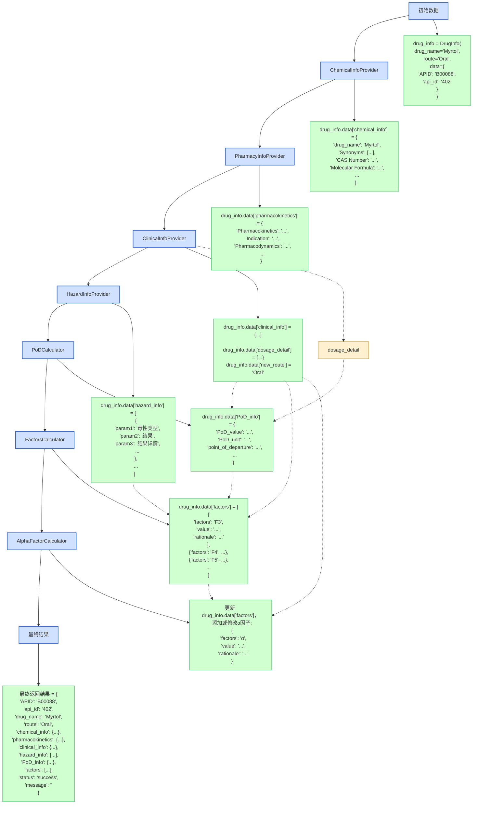

# 药物信息处理系统数据流向详解

数据如何在各个处理步骤中传递和转换，以及每个步骤产生的具体信息。

## 初始数据

当执行`processor.process_drug("Myrtol", "Oral", "B00088", "402")`时，初始数据为：

```
python
复制
drug_info = DrugInfo(
    drug_name="Myrtol",
    route="Oral",
    data={
        "APID": "B00088",
        "api_id": "402"
    }
)
```

## 1. ChemicalInfoProvider 数据流

**输入**：

- `drug_name="Myrtol"`

**处理**：

- 调用`baseinfo.get_chemical_info("Myrtol")`获取化学信息

**输出**：

- 在

  ```
  drug_info.data
  ```

  中添加

  ```
  chemical_info
  ```

  字段，包含：

  ```
  python
  复制
  "chemical_info": {
      "drug_name": "Myrtol",
      "Synonyms": ["..."],  # 药物同义词列表
      "CAS Number": "...",  # CAS注册号
      "Molecular Formula": "...",  # 分子式
      "Molecular Weight": "...",  # 分子量
      "Smiles": "...",  # SMILES表示法
      "InchI Key": "...",  # InChI密钥
      "IUPAC Name": "...",  # IUPAC命名
      "Description": "...",  # 描述
      "ATC Code": "...",  # ATC代码
      "Pharmacotherapeutic Group": "...",  # 药理治疗组
      "Appearance": "...",  # 外观
      "Solubility": "...",  # 溶解性
      "reference_links": ["..."]  # 参考链接
  }
  ```

## 2. PharmacyInfoProvider 数据流

**输入**：

- `drug_name="Myrtol"`
- 上一步处理后的`drug_info`

**处理**：

- 调用`pharmacy.get_pharmacokinetics("Myrtol")`获取药理学信息

**输出**：

- 在

  ```
  drug_info.data
  ```

  中添加

  ```
  pharmacokinetics
  ```

  字段，包含：

  ```
  python
  复制
  "pharmacokinetics": {
      "Pharmacokinetics": "...",  # 药代动力学
      "Indication": "...",  # 适应症
      "Pharmacodynamics": "...",  # 药效学
      "Mechanism of Action": "...",  # 作用机制
      "reference_links": ["..."]  # 参考链接
  }
  ```

## 3. ClinicalInfoProvider 数据流

**输入**：

- `drug_name="Myrtol"`
- `route="Oral"`
- 上一步处理后的`drug_info`

**处理**：

- 调用`Clinical.clinical("Myrtol", "Oral")`获取临床用药信息

**输出**：

- 在

  ```
  drug_info.data
  ```

  中添加三个字段：

  ```
  python
  复制
  "clinical_info": {
      "Clinical": "...",  # 临床信息
      "reference_links": ["..."]  # 参考链接
  },
  "dosage_detail": {
      # 剂量详情，如给药剂量、频率等
  },
  "new_route": "Oral"  # 可能更新的给药途径
  ```

## 4. HazardInfoProvider 数据流

**输入**：

- `drug_name="Myrtol"`
- 上一步处理后的`drug_info`

**处理**：

- 调用`hazards.all_toxicities("Myrtol")`获取毒性信息

**输出**：

- 在

  ```
  drug_info.data
  ```

  中添加

  ```
  hazard_info
  ```

  字段，包含毒性信息数组：

  ```
  python
  复制
  "hazard_info": [
      {
          "param1": "...",  # 毒性类型
          "param2": "...",  # 结果
          "param3": "...",  # 结果详情
          "reference_links": ["..."]  # 参考链接
      },
      # 更多毒性记录...
  ]
  ```

## 5. PoDCalculator 数据流

**输入**：

- `drug_name="Myrtol"`
- `clinical_info`（来自步骤 3）
- `dosage_detail`（来自步骤 3）
- 上一步处理后的`drug_info`

**处理**：

- 调用`PoD.PoD_value("Myrtol", clinical=clinical, dosage_detail=dosage_detail)`计算 PoD 值

**输出**：

- 在

  ```
  drug_info.data
  ```

  中添加

  ```
  PoD_info
  ```

  字段，包含：

  ```
  python
  复制
  "PoD_info": {
      "PoD_value": "...",  # PoD数值
      "PoD_unit": "...",  # PoD单位
      "point_of_departure": "...",  # 起点剂量类型
      "point_of_departure_detail": "..."  # 起点剂量详情
  }
  ```

## 6. FactorsCalculator 数据流

**输入**：

- `clinical_info`（来自步骤 3）
- `hazard_info`（来自步骤 4）
- `PoD_info`（来自步骤 5）
- 上一步处理后的`drug_info`

**处理**：

1. 调用`F3.F3_value(clinical)`计算 F3 因子
2. 调用`F4.F4_value(clinical, hazard)`计算 F4 因子
3. 调用`F5.F5_value(PoD_detail, clinical)`计算 F5 因子
4. 调用`other_factors.other_factors()`获取其他因子

**输出**：

- 在

  ```
  drug_info.data
  ```

  中添加

  ```
  factors
  ```

  字段，包含因子数组：

  ```
  python
  复制
  "factors": [
      {
          "factors": "F3",  # 因子名称
          "value": "...",   # 因子值
          "rationale": "..."  # 因子计算依据
      },
      {
          "factors": "F4",
          "value": "...",
          "rationale": "..."
      },
      {
          "factors": "F5",
          "value": "...",
          "rationale": "..."
      },
      # 其他因子...
  ]
  ```

## 7. AlphaFactorCalculator 数据流

**输入**：

- `drug_name="Myrtol"`
- `route="Oral"`
- `new_route`（来自步骤 3）
- `factors`（来自步骤 6）
- 上一步处理后的`drug_info`

**处理**：

- 检查给药途径是否变化（比较`route`和`new_route`）
- 如果变化，调用`alpha_factor.a_factor("Myrtol", new_route, "Oral")`计算 α 因子

**输出**：

- 如果给药途径发生变化，更新

  ```
  drug_info.data['factors']
  ```

  ，添加或修改 α 因子：

  ```
  python
  复制
  {
      "factors": "α",  # 因子名称
      "value": "...",  # 因子值
      "rationale": "..."  # 因子计算依据
  }
  ```

## 最终数据结构

管道处理完成后，`drug_info.data`包含以下完整信息：

```
python
复制
{
    "APID": "B00088",
    "api_id": "402",
    "chemical_info": {
        # 化学信息，来自步骤1
    },
    "pharmacokinetics": {
        # 药理学信息，来自步骤2
    },
    "clinical_info": {
        # 临床信息，来自步骤3
    },
    "dosage_detail": {
        # 剂量详情，来自步骤3
    },
    "new_route": "Oral",  # 可能更新的给药途径，来自步骤3
    "hazard_info": [
        # 危害信息数组，来自步骤4
    ],
    "PoD_info": {
        # PoD信息，来自步骤5
    },
    "factors": [
        # 因子数组，来自步骤6和7
    ],
    "errors": [
        # 如果有错误，这里会包含错误信息
    ]
}
```

## 最终输出结果

`process_drug`方法返回的结果结构如下：

```
python
复制
{
    "APID": "B00088",
    "api_id": "402",
    "drug_name": "Myrtol",
    "route": "Oral",
    "chemical_info": {
        # 化学信息
    },
    "pharmacokinetics": {
        # 药理学信息
    },
    "clinical_info": {
        # 临床信息
    },
    "hazard_info": [
        # 危害信息
    ],
    "PoD_info": {
        # PoD信息
    },
    "factors": [
        # 因子信息
    ],
    "status": "success",  # 或 "partial_success"，如果有错误
    "message": ""  # 如果有错误，这里会包含错误消息
}
```

## 数据依赖关系

从数据流向可以看出以下依赖关系：

1. `PoDCalculator`依赖于`ClinicalInfoProvider`的输出
2. `FactorsCalculator`依赖于`ClinicalInfoProvider`、`HazardInfoProvider`和`PoDCalculator`的输出
3. `AlphaFactorCalculator`依赖于`ClinicalInfoProvider`和`FactorsCalculator`的输出

这种依赖关系决定了处理步骤的顺序，确保每个步骤都能获取到所需的输入数据。

## 数据转换过程

整个流程中的数据转换可以概括为：

1. **收集阶段**（步骤 1-4）：从各种来源收集药物的不同方面的信息
2. **计算阶段**（步骤 5-7）：基于收集到的信息进行各种计算和分析
3. **整合阶段**（最终结果）：将所有信息整合成一个完整的药物信息报告

这种分层处理方式使得系统能够处理复杂的药物信息，同时保持代码的清晰和可维护性。

## 数据流向图



这个图包含以下关键元素：

### 主要组件

1. **处理器节点**（蓝色框）：
   - 系统中的各个处理器，从初始数据到最终结果
   - 每个处理器负责特定的数据处理任务
2. **数据节点**（绿色框）：
   - 每个处理器生成或修改的数据
   - 显示了数据的具体结构和内容
3. **中间数据节点**（黄色框）：
   - 如`dosage_detail`这样从主数据中提取的中间数据

### 数据流向

1. **主流程**（实线箭头）：
   - 从初始数据开始，经过各个处理器，最终生成结果
   - 每个处理器按顺序执行，处理前一步的输出
2. **数据生成**（实线箭头）：
   - 从处理器到数据节点的箭头
   - 表示处理器生成或修改了特定的数据
3. **数据依赖**（虚线箭头）：
   - 表示某个处理器依赖于之前生成的数据
   - 例如，`PoDCalculator`依赖于`clinical_info`和`dosage_detail`

### 关键数据依赖关系

图中清晰地展示了几个重要的数据依赖关系：

1. **PoDCalculator 的依赖**：
   - 依赖于`clinical_info`和`dosage_detail`
   - 这些数据由`ClinicalInfoProvider`生成
2. **FactorsCalculator 的依赖**：
   - 依赖于`clinical_info`、`hazard_info`和`PoD_info`
   - 这些数据分别由不同的处理器生成
3. **AlphaFactorCalculator 的依赖**：
   - 依赖于`clinical_info`和`factors`
   - 用于计算或更新 α 因子
